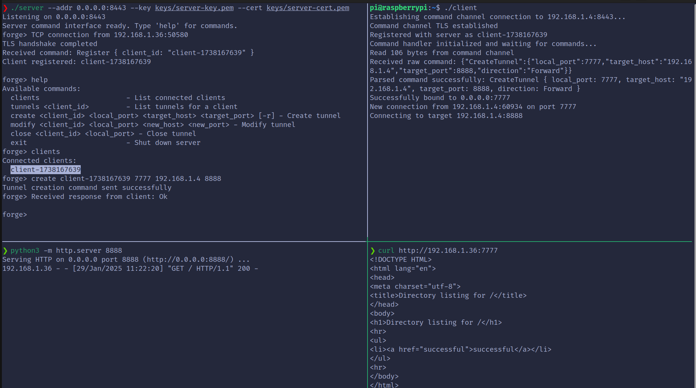

# Forge - TCP Tunneling Tool

Forge is a TCP tunneling tool written in Rust that allows you to create tunnels between hosts with a TLS-encrypted command channel for secure tunnel management. The actual tunnel traffic is transported over direct TCP connections.

**Note:** This is an actively developed project. The current implementation includes detailed debug messages which, while verbose, are intentionally left in place to assist with development and troubleshooting during this phase.

## Features

- **Dynamic Reconfiguration**: Ability to modify tunnel endpoints (ports and IP addresses) without restarting
- **Live Port Modification**: Change local listening ports on the fly
- **Target Flexibility**: Dynamically update target hosts and ports for existing tunnels
- **Secure Command Channel**: Control messages are sent over a TLS-encrypted connection
- **Interactive Management**: Command-line interface for managing tunnels
- **Network Routing**: Connect to any machine reachable from the client, including internal LAN networks and subnets

## Prerequisites

- Rust 1.70 or later
- OpenSSL command-line tools (for certificate generation)

## Quick Start

1. Clone the repository and navigate to the project directory.
   ```bash
   git clone https://github.com/GobiasSomeCoffeeCo/forge.git
   ```

2. Run the setup script to generate certificates and build the project:
   ```bash
   ./build-forge.sh
   ```
   You will be prompted to enter the server's IP address.

3. Start the server:
   ```bash
   ./server --addr 0.0.0.0:8443 --key keys/server-key.pem --cert keys/server-cert.pem
   ```

4. In a separate terminal or on another machine, start the client:
   ```bash
   ./client
   ```

## Usage Examples

### Multiple Clients
You can deploy the client to multiple machines in your network. Each client automatically generates a unique ID based on timestamp, making it easy to manage multiple connections:

```bash
# Copy the client binary to multiple machines
scp client machine1:/opt/forge/
scp client machine2:/opt/forge/
scp client machine3:/opt/forge/

# Each client will connect with its own unique ID
# On the server you'll see them as different clients:
forge> clients
Connected clients:
  client-1706511234
  client-1706511245
  client-1706511256
```

### Internal Network Access
If your client is on a LAN (e.g., 192.168.1.0/24), you can create tunnels to any reachable machine:

```bash
# On the server
forge> create client-1234 8080 192.168.1.50 80    # Access internal web server
forge> create client-1234 3389 192.168.1.100 3389  # Access internal RDP server
```

This allows the server to access machines that are only reachable from the client's network.

```bash
forge> create client-1234 2222 10.10.10.100 22  # Access ssh server on internal LAN

[Server]               [Client]                 [LAN Machine]
192.168.1.10    192.168.1.50/10.10.10.50       10.10.10.100
     ^                    ^                          ^
     |                    |                          |
TLS :8443<-------------->:8443                       |
                    :2222 listening                  |
                         |                           |
                         +------------------------->:22
```

## Configuration

### Server Configuration

The server accepts the following command-line arguments:

- `--addr`: Address to listen on (default: "127.0.0.1:8443")
- `--key`: Path to server private key (PKCS8 PEM)
- `--cert`: Path to server certificate (PEM)
- `--allow-udp`: Allow UDP tunnels (default: TCP only) # Currently not implemented
- `--port-range`: Port range allowed for tunnels (default: "1024-65535")

### Client Configuration

Client configuration is stored in `config.toml`:

```toml
server_address = "192.168.1.4:8443"
server_sni = "192.168.1.4"
ca_cert = "ca-cert.pem"
```

## Server Commands

Once the server is running, you can use the following commands in the server's interactive console:

- `help`: Display available commands
- `clients`: List connected clients
- `tunnels <client_id>`: List tunnels for a specific client
- `create <client_id> <local_port> <target_host> <target_port>`: Create a new tunnel
- `modify <client_id> <local_port> <new_host> <new_port>`: Modify an existing tunnel
- `close <client_id> <local_port>`: Close a tunnel
- `exit`: Shut down the server

## Security

The project implements several security measures:

- TLS encryption for the command channel (server certificate verification)
- Configurable port ranges to restrict tunnel endpoints (default: 1024-65535)
- Client registration system for tunnel management

## Architecture

### Components

- **TunnelManager**: Handles creation and management of tunnels
- **MultiplexedTunnel**: Manages multiple logical connections over a single TLS connection
- **Protocol**: Defines the command and control protocol between client and server


## Limitations

- Currently supports TCP tunnels only (UDP support planned)
- No built-in authentication beyond TLS certificates
- TCP tunnels created are currently unencrypted

## Troubleshooting

### Common Issues

1. **Certificate Errors**
   - Ensure the CA certificate is properly configured
   - Verify the server's certificate matches its hostname/IP
   - Check certificate expiration dates

2. **Connection Issues**
   - Verify the server address and port are correct
   - Check firewall settings
   - Ensure the target service is running

3. **Permission Issues**
   - Ports below 1024 require root/administrator privileges
   - Check file permissions on certificates and keys

### Debug Logging

Both client and server provide detailed logging. Check the console output for error messages and connection details.




